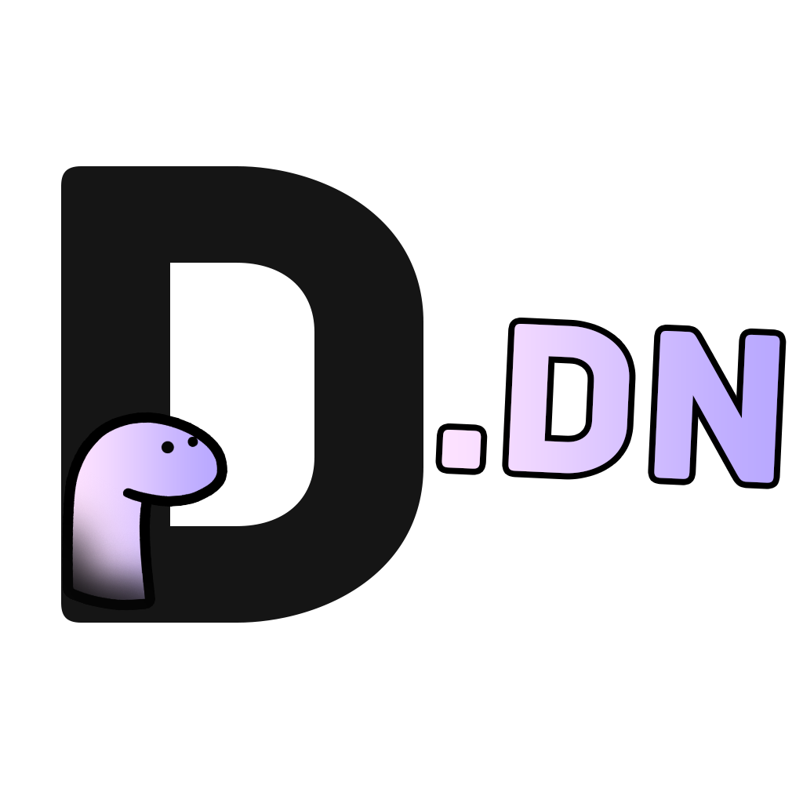

<!-- ALL-CONTRIBUTORS-BADGE:START - Do not remove or modify this section -->

<!-- ALL-CONTRIBUTORS-BADGE:END -->
  
  <h1>Discord.dn</h1>

> A Deno Library to interact with the Discord API

## Contributors ✨

Thanks goes to these wonderful people ([emoji key](https://allcontributors.org/docs/en/emoji-key)):

<!-- ALL-CONTRIBUTORS-LIST:START - Do not remove or modify this section -->
<!-- prettier-ignore-start -->
<!-- markdownlint-disable -->
<table>
  <tr>
    <td align="center"><a href="https://cosmicice.cat"> <b>cosmicice</b></a> <a href="https://github.com/discorddn/discord.dn/commits?author=catcosmicice" title="Code">💻</a> <a href="https://github.com/discorddn/discord.dn/commits?author=catcosmicice" title="Documentation">📖</a></td>
    <td align="center"><a href="https://github.com/DARKDRAGON532"> <b>DARKDRAGON532</b></a> <a href="https://github.com/discorddn/discord.dn/commits?author=DARKDRAGON532" title="Code">💻</a> <a href="https://github.com/discorddn/discord.dn/commits?author=DARKDRAGON532" title="Documentation">📖</a></td>
    <td align="center"><a href="https://nortex.xyz/"> <b>NorteX-dev</b></a> <a href="https://github.com/discorddn/discord.dn/commits?author=NorteX-dev" title="Code">💻</a> <a href="https://github.com/discorddn/discord.dn/commits?author=NorteX-dev" title="Documentation">📖</a></td>
  </tr>
</table>

<!-- markdownlint-restore -->
<!-- prettier-ignore-end -->

<!-- ALL-CONTRIBUTORS-LIST:END -->

This project follows the [all-contributors](https://github.com/all-contributors/all-contributors) specification. Contributions of any kind welcome!
